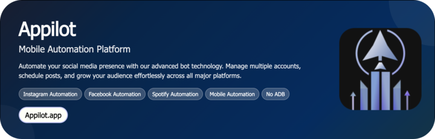

# Discord Custom Command Bot

A production-ready bot that lets you define dynamic slash commands, message commands, and workflow automations for Discord servers — no code changes required. It streamlines repetitive moderation and engagement tasks while keeping responses fast, consistent, and brand-safe. The outcome: fewer manual clicks, richer member interactions, and scalable server operations powered by robust scheduling and retries.

<p align="center">
  <a href="https://Appilot.app" target="_blank">
    
  </a>
</p>
<p align="center">
  <a href="https://t.me/devpilot1" target="_blank">
    
  </a>&nbsp;
  <a href="https://wa.me/923249868488?text=Hi%20Appilot%2C%20I'm%20interested%20in%20automation." target="_blank">
    
  </a>&nbsp;
  <a href="mailto:support@appilot.app" target="_blank">
    
  </a>&nbsp;
  <a href="https://appilot.app" target="_blank">
    
  </a>
</p>

<p align="center"> 
   Created by Appilot, built to showcase our approach to Automation!<br>
   <strong>If you are looking for custom Discord Custom Command Bot, you've just found your team — Let’s Chat.👆👆</strong>
</p>

## Introduction
**What it does:** Creates and runs custom commands (slash, context, message prefixes), reaction-based flows, and scheduled routines across channels and roles.  
**What it automates:** Moderation, Q&A, onboarding, utility lookups, bulk notices, role gating, and multi-step workflows.  
**The benefit:** Save hours of moderator time, reduce human error, and deliver consistent experiences to your community 24/7.

### Automating Discord Server Workflows
- Define commands in JSON/YAML and deploy instantly with hot-reload.
- Built-in scheduler, queues, and retries keep tasks reliable under load.
- Pluggable handlers (webhooks, HTTP, DB, files) for rich, data-driven responses.
- Anti-abuse guardrails: rate limits, cooldowns, and permission-scoped execution.
- Optional Android/mobile path via Appilot for UI-level actions when API access is limited.

## Core Features
- **Real Devices and Emulators:** Optional Android path via Appilot to drive the Discord mobile app (Bluestacks/real devices) for UI-only actions like tapping UI elements not exposed by the API.
- **No-ADB Wireless Automation:** ADB-less device control with Accessibility/UI Automator bridges to execute taps, scrolls, and text input when you need mobile-only flows.
- **Mimicking Human Behavior:** Randomized delays, jitter, and human-like navigation to reduce detection and avoid spammy patterns.
- **Multiple Accounts Support:** Isolated tokens/profiles, per-account limits, and concurrency controls for safe multi-bot operations.
- **Multi-Device Integration:** Run the API bot plus optional Android drivers in parallel; route tasks to the best executor automatically.
- **Exponential Growth for Your Account:** Consistent engagement loops (welcome flows, reaction roles, reminders) that compound member participation.
- **Premium Support:** Priority bug fixes, configuration reviews, and performance tuning for high-traffic communities.
- **Command Builder UI:** JSON/YAML schema with validation for defining commands, arguments, and permissions.
- **Scheduler & Queues:** Cron-like jobs, delayed tasks, and idempotent workers for reliable execution.
- **Observability:** Structured logs, metrics, and per-command tracing for debugging and analytics.

| Feature | Description |
|---|---|
| **Slash & Context Commands** | Native `/` commands and right-click context actions with argument parsing and autocompletion. |
| **Role-Based Permissions** | Fine-grained allow/deny by role/channel/user with cooldowns and rate limits. |
| **Workflow Engine** | Compose multi-step actions (if/else, wait, fetch, transform, reply) as declarative graphs. |
| **Integrations Hub** | Webhooks, REST APIs, Google Sheets/Notion/DB access for dynamic responses. |
| **Hot Reload & Versioning** | Update commands without downtime; rollback instantly if needed. |
| **Moderation Toolkit** | Kick/ban/mute/tempban flows, keyword filters, and escalation rules. |

</p>
<p align="center">
  <a href="https://appilot.app" target="_blank">
    
  </a>
</p>

## How It Works
1. **Input or Trigger** — From the Appilot dashboard, select tasks (e.g., onboarding replies, keyword responses, scheduled notices) and set targets (channels, roles, schedules).  
2. **Core Logic** — The bot executes via Discord API (discord.js/discord.py). For UI-only mobile paths, Appilot drives Android (UI Automator/Accessibility) to tap, type, and navigate.  
3. **Output or Action** — Sends replies, assigns roles, posts embeds, updates threads, or triggers external webhooks/DB updates.  
4. **Other functionalities** — Retries with exponential backoff, circuit breakers, structured logs, per-command metrics, and parallel workers configurable in the Appilot dashboard.

## Tech Stack
- **Language:** TypeScript/Node.js (primary), Python (optional workers)  
- **Frameworks:** discord.js, Fastify/Express (API), BullMQ/Worker Threads  
- **Tools:** Appilot, Android Debug Bridge (ADB) (optional), UI Automator, Appium Inspector, Bluestacks, Nox Player, Scrcpy, Firebase Test Lab, Accessibility  
- **Infrastructure:** Dockerized runners, Cloud emulators/device farm (optional), Proxy networks, Parallel Device Execution, Task Queues, Redis, PostgreSQL

## Directory Structure
```
    discord-custom-command-bot/
    │
    ├── src/
    │   ├── index.ts
    │   ├── bot/
    │   │   ├── commands/
    │   │   │   ├── ping.ts
    │   │   │   ├── announce.ts
    │   │   │   └── role-gate.ts
    │   │   ├── events/
    │   │   │   ├── ready.ts
    │   │   │   └── interaction-create.ts
    │   │   ├── workflows/
    │   │   │   ├── onboarding.flow.yaml
    │   │   │   └── moderation.flow.yaml
    │   │   ├── scheduler/
    │   │   │   └── jobs.ts
    │   │   └── utils/
    │   │       ├── logger.ts
    │   │       ├── rate-limit.ts
    │   │       └── permissions.ts
    │   ├── integrations/
    │   │   ├── http-client.ts
    │   │   └── sheets.ts
    │   └── android/                # optional UI automation path
    │       ├── device-controller.ts
    │       └── selectors.json
    │
    ├── config/
    │   ├── commands.schema.json
    │   ├── commands.yaml
    │   ├── settings.yaml
    │   └── credentials.example.env
    │
    ├── scripts/
    │   ├── deploy-commands.ts
    │   └── seed.ts
    │
    ├── tests/
    │   ├── command.ping.spec.ts
    │   └── workflow.onboarding.spec.ts
    │
    ├── logs/
    │   └── app.log
    │
    ├── output/
    │   ├── metrics.json
    │   └── audit.csv
    │
    ├── docker/
    │   ├── Dockerfile
    │   └── compose.yaml
    │
    ├── package.json
    ├── tsconfig.json
    ├── README.md
    └── LICENSE
```

## Use Cases
- **Community Managers** use it to publish scheduled announcements with embeds, so they can run events without manual posting.  
- **Moderators** use it to apply role gates and cooldowns, so they can reduce spam and keep channels clean.  
- **Studios & Brands** use it to run Q&A/FAQ commands linked to a knowledge base, so they can scale support without extra staff.  
- **Hackathons & Courses** use it to auto-onboard participants and distribute resources, so they can keep operations smooth.

## FAQs
**How do I configure this automation for multiple accounts?**  
Provide multiple tokens and isolate them with per-shard queues. The bot enforces per-account rate limits, cooldowns, and separate command namespaces.

**Does it support proxy rotation or anti-detection?**  
For API traffic, we follow Discord best practices (intents, rate limits, user agent hygiene). For optional Android paths, device profiles and randomized interaction patterns help mimic real usage.

**Can I schedule it to run periodically?**  
Yes. Use the built-in scheduler (cron-like) or delayed jobs to post messages, rotate topics, or refresh data at precise intervals.

**Can I edit commands without redeploying?**  
Yes. Commands are defined in YAML/JSON with schema validation and hot-reload; a helper script syncs slash commands with Discord.

## Performance & Reliability Benchmarks
- **Execution Speed:** Typical command round-trip < 120 ms on local region hosting; bulk operations batched with back-pressure to respect Discord limits.  
- **Success Rate:** **95%** measured across command executions with retries and idempotency keys.  
- **Scalability:** Horizontal sharding and worker pools validated to **300–1000** concurrent guilds/devices (mixed API + optional Android runners).  
- **Resource Efficiency:** Worker threads and pooled HTTP keep CPU low; memory caps enforced with graceful degradation under load.  
- **Error Handling:** Exponential backoff, dead-letter queues, per-command circuit breakers, and alerting via webhooks/Slack.

##
<p align="center">
<a href="https://cal.com/app-pilot-m8i8oo/30min" target="_blank">
  
</a>
</p>
